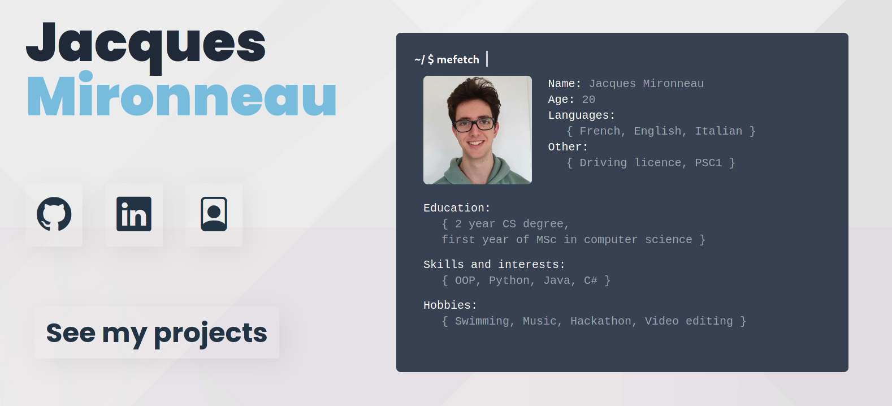

# Portfolio

Highly customisable and easy to update web based portfolio.  
The aim of this project is to provide an out of the box portfolio to present project, ideas... in an easy way.The project uses Flask framework, with jinja2 templates for rendering and sqlite3 for the data storage.  
This project is composed of **two different views**: the visitor one, and the administrator one.  

The administrator can add a project and upload files to an already created project. In order to create a project the administrator must provide a name, a short description and a longer one. Plus, he can add images, gif and so on to the project.
Once the project will be created it can be seen on the `/projects` page by every visitor.  
In this way, it will be easy to just add new project by using a web interface, instead of modifying the code base.
This project is made to be set up once and then add the projects later on. By the time you will have released new project, you can simply add them on the portfolio.  

<p align="center">
 
</p>

### Set up and run:
```
python3 -m venv .
. venv/bin/activate
pip install -r requirements.txt
export FLASK_APP=view.py
flask run
```
### Routes:

The project is by default launched on localhost on port 5000.  
**Main page: (Information about the person)**  
`/`  
**To upload images, gif, video to a project:**  
`/upload/`  
**To add a project:**  
`/add/`  
**To display the existing projects:**  
`/projects/`  
**Details on a given project:**  
`/project/[n]`  
n is here the project id  

### Project structure
<pre>
.  
├── <b>readme_res/</b>: readme ressources (screenshot)  
├── <b>static/</b>:  images, icons, and css,js files  
├── <b>templates/</b>: jinja2 templates files (html and python)  
└── <b>/</b>: python files:  
   ├── <b>models.py</b>: SQLAlchemy tables using python class  
   ├── <b>run.py</b>: Flask configuration file 
   ├── <b>run.sh</b>: bash script used to launch the project with python venv  
   ├── <b>view.py</b>: Flask routing files handling database operations  
   └── <b>resetdb.py</b>: standalone script to remove project_images and database content   
</pre>


### Technical implementation

This project uses sqlite3 with the python SQLAlchemy ORM with two different tables.
A project represents the unit of the application, a project has several ressources (Project_files) that can be upload with the `/upload/` route.

| Project        | Description                                                  | Type           |
|----------------|--------------------------------------------------------------|----------------|
| id             | Id of the project (primary key)                              | auto indent PK |
| project_name   | Name of the project                                          | String(200)    |
| short_desc     | Short description that is displayed on the `/projects/` page | Text           |
| long_desc      | Longer description used for the `/project/[n]` pages         | Text           |
| attached_files | Reference to Project_files objects (associated files)        | Project_files  |


| Project_files | Description                                                             | Type            |
|---------------|-------------------------------------------------------------------------|-----------------|
| id            | Id of the file (primary key)                                            | auto indent PK  |
| project_id    | ID of the project that owns this file                                   | int FK(Project) |
| file_url      | url of the file (path in the server files)                              | String(100)     |
| is_background | true if the images must be displayed on background (see `/project/[n]`) | boolean         |

### TODO:  
- [ ] Docker compose  :exclamation:
- [ ] Style project page
- [ ] Main page customization
- [ ] Mobile responsive
- [ ] Create admin page (merging add.html and upload.html could be a great start)
- [ ] Secure Authentification
- [ ] Optimise css :exclamation:
- [ ] Optimise js :exclamation:
