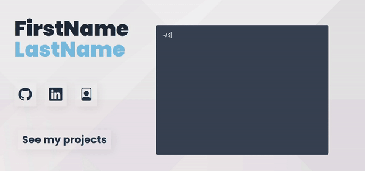

# Portfolio

Highly customisable and easy to update web based portfolio.  
The aim of this project is to provide an out of the box portfolio to present project, ideas... in an easy way.The project uses Flask framework, with jinja2 templates for rendering and sqlite3/postgresql for the data storage.  

### Usage

You can set up your profile with the `config.toml` file and then add your project on the `/add/` route.
In order to create a project you must provide a name, a description, a link to source code and a thumbnail. At every moment you can update or delete a project by using `/update/` and `/delete/`. Once the project is created it can be seen on the `/projects/` page by every visitor.  
In this way, it will be easy to just add new project by using a web interface, instead of modifying the code base.
This project is made to be set up once and then add the projects later on. By the time you will have released new project, you can simply add them on the portfolio.  

<p align="center">
 
</p>

### Customization:

This project is made to be easily customizable, just fill in your data in the `config.toml`.
Example:
```toml
[data]
firstname="YourFirstName"
lastname="YourLastName"
age=18
languages=[ "English", "German"]
other=[ "Driving licence", "..."]
degree=[]
skills=["Javascript", "Python", "Java", "C#"]
hobbies=["Developping", "Designing", "Deploying"]
github="GithubPseudo"
linkedin="LinkedinUsername"
cv="url"
pp="link to your awesome profile picture"

```

### Set up and run (dev/local):
```
python3 -m venv .
. venv/bin/activate
pip install -r requirements.txt
export FLASK_APP=view.py
# If you want to use the default database let PEF_DB env var empty. (using sqlite3)
# If no put your psql connection string in PEF_DB
export PEF_DB=insert_psql_connection_string
flask run
```

### Host:

The project can be host on heroku, using the Procfile and gunicorn.  
See [heroku_set_up.md](heroku_set_up.md) for installation.


You can also selfhost using docker-compose. (see `docker-compose.yml`)  
```docker-compose up```  
The web app wll be available on 0.0.0.0 (on port 80)
and the database on localhost (port 5432)

### Routes:

The project is by default launched on localhost on port 5000.  
**Main page: (Information about the person)**  
`/`  
**To display the existing projects:**  
`/projects/`   
**To access the following commands**  
`/login/`  
**To add a project:**  
`/add/`  
**To delete one or several projects:**  
`/delete/`  
**To update a project:**  
`/update/`


### Project structure
<pre>
.  
├── <b>readme_res/</b>: readme ressources (screenshot)  
├── <b>static/</b>:  images, icons, and css,js files  
├── <b>templates/</b>: jinja2 templates files (html and python)  
└── <b>/</b>: python app files:  
   ├── <b>models.py</b>: SQLAlchemy tables using python class  
   ├── <b>app.py</b>: Flask configuration file 
   ├── <b>view.py</b>: Flask routing files handling database operations  
   └── <b>gdrive_management.py</b>: Google drive api connection and operations
    Scripts:
   ├── <b>run.sh</b>: bash script used to launch the project with python venv  
   ├── <b>manage_user.py</b>: python script to handle users (add, list, remove)
   └── <b>resetdb.py</b>: standalone script to remove project_images and database content
   Deploy
   ├── <b>Procfile</b>: heroku file to run gunicorn on their dynos
   ├── <b>Dockerfile</b>: docker build for the web (flask) application
   └── <b>docker-compose.yaml</b>: compose specification for host with container
   Others
   ├── <b>config.toml</b>: user data to fill index page
   └── <b>requirements.txt</b>: pip dependencies of the app
   

</pre>


### Technical implementation

This project uses sqlite3/psql with the python SQLAlchemy ORM with two different tables.
A project represents the unit of the application, a project has a name, a description, an url (for the code repository mainly) and a thumbnail. 

| Project        | Description                                                  | Type           |
|----------------|--------------------------------------------------------------|----------------|
| id             | Id of the project (primary key)                              | auto indent PK |
| project_name   | Name of the project                                          | String(200)    |
| project_desc    | Short description that is displayed on the `/projects/` page | Text           |
| project_url    | Url used in the "more details" in `/projects/`         | String(300)    |
| project_thumbnail | Thumbnail for the project in the `/projects/` page  | String(300) |

### TODO:  
- [x] Docker compose  :exclamation:
- [x] Main page customization
- [x] Create admin page (merging add.html and upload.html could be a great start)
- [x] Optimise css :exclamation:
- [x] Optimise js :exclamation:
- [x] Secure Authentification
- [ ] Docker compose: enhance security
- [ ] Mobile responsive
- [ ] write heroku_set_up.md

For project progress see: https://trello.com/b/ctrkfRUm/pef
